<div align="left">

# 👋 **Hi there! I'm Mawande Madolo**


```
╔══════════════════════════════════════════════════════════════╗
║  🎯 Passionate about building scalable backend systems       ║
║  ☁️  Professional AWS & Linux infrastructure experience      ║
║  🚀 Transforming from infrastructure to software engineering ║
╚══════════════════════════════════════════════════════════════╝
```

</div>

---

## 🚀 **`About Me`**

- **`Backend-focused engineer`** specializing in scalable server-side applications and cloud infrastructure  
- **`AWS Support Engineer`** with hands-on experience across the entire AWS ecosystem  
- **`Linux enthusiast`** specializing in multi-distribution system administration  
- **`Continuous learner`** building comprehensive backend engineering skills through practical projects  

<div align="left">

| 🎓 **`Education`** | 💼 **`Current Role`** | 🎯 **`Career Goal`** |
|:---:|:---:|:---:|
| Bachelor of Technology<br>IT - Communication Networks | Cloud Support Engr.<br>@ AWS Support | Software Development Engineer<br>(Backend Focus) |

</div>

---

## 💼 **`Professional Journey`**

<div align="left">

</div>

### 🏗️ **`Cloud Infrastructure`**
- Extensive AWS services ecosystem experience (30+ services)  
- Multi-account architecture and best practices  
- Enterprise-grade cloud solutions and optimization  

### 🐧 **`Linux Systems`**
- Amazon Linux 2023, RHEL, Ubuntu, SUSE administration  
- Performance tuning and security hardening  
- Multi-distribution environment management  

### 🤖 **`Automation & Scripting`**
- AWS Systems Manager & SSM Automation  
- Infrastructure automation and orchestration  
- EC2 fleet management and Auto Scaling  
- CloudFormation Infrastructure as Code  

### 🎯 **`Customer Success`**
- Technical consultation and problem resolution  
- Complex troubleshooting and root cause analysis  
- Performance optimization and cost management  

---

## 🛠️ **`Tech Stack`**

<div align="left">

### **`Backend Development`**


### **`Development Tools`**


### **`Frontend Technologies`** *(Experience with proprietary AWS internal tools)*


### **`AWS Compute & Containers`**


### **`AWS Networking & Security`**


### **`AWS Management & Monitoring`**


### **`AWS Messaging & Analytics`**


### **`AWS Development Tools`**


### **`Infrastructure & DevOps`**


### **`Database & Data Persistence`**


</div>

---

> **`📝 Note:`** Frontend projects developed using AWS internal tools (CloudScape) and proprietary platforms cannot be shared publicly, but experience includes modern React/TypeScript applications and responsive web interfaces.

</div>

---

## 📊 **`GitHub Analytics`**

<div align="left">


</div>

---

## 🎯 **`Current Learning Path`**

```mermaid
graph TD
    A[🏗️ Infrastructure Expert] --> B[⚙️ Backend Developer]
    B --> C[☁️ Cloud-Native Engineer]
    C --> D[🎯 Software Architect]
    
    A --> E[30+ AWS Services]
    A --> F[Linux Systems]
    B --> G[Java/Python APIs]
    B --> H[Database Design]
    C --> I[Containers/Serverless]
    C --> J[Microservices]
```

<div align="left">



</div>

### 🔥 **`Focus Areas`**

#### 🔧 **`Backend APIs`**
- RESTful services architecture  
- Microservices design patterns  
- Scalable system architecture  

#### 🗄️ **`Database Design`**
- Multi-database applications  
- Performance optimization techniques  
- Data modeling best practices  

#### ☁️ **`Cloud-Native Development`**
- AWS-integrated solutions  
- Serverless architecture patterns  
- Container orchestration  

#### 🐳 **`DevOps & Infrastructure`**
- Infrastructure as Code mastery  
- Automation and orchestration  
- Monitoring and observability  

#### 🚀 **`Performance Engineering`**
- Scalable system design  
- Reliability engineering  
- Performance optimization  

---

## 🌟 **`Career Transformation`**

<div align="left">

```
┌─────────────────────────────────────────────────────────────┐
│           🛤️  From Infrastructure → Backend Engineering     │
└─────────────────────────────────────────────────────────────┘
```

</div>

### 💪 **`Core Strengths`**
- Deep cloud infrastructure knowledge (30+ AWS services)  
- Strong problem-solving from enterprise support experience  
- Professional Linux & AWS operational expertise  
- Hands-on containerization & serverless implementation  

### 🎯 **`Unique Value Proposition`**
- Bridges infrastructure & application development layers  
- Systematic and methodical approach to learning  
- Combined operational + development perspective  
- Multi-database platform expertise and experience  

---

## 🤝 **`Let's Connect!`**

<div align="left">

[](https://www.linkedin.com/in/mawandemadolo)
[](https://github.com/mawandemadolo)

```
┌─────────────────────────────────────────────────────────────┐
│  💡 "Building scalable backend systems through the          │
│      intersection of infrastructure expertise and           │
│      cloud-native development."                             │
└─────────────────────────────────────────────────────────────┘
```


</div>
